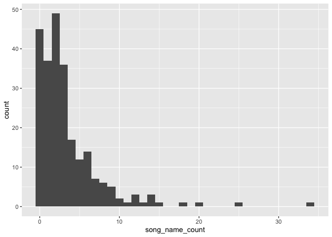
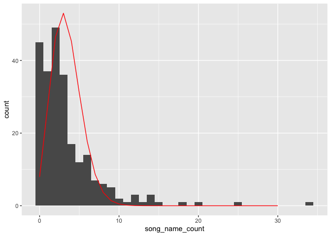
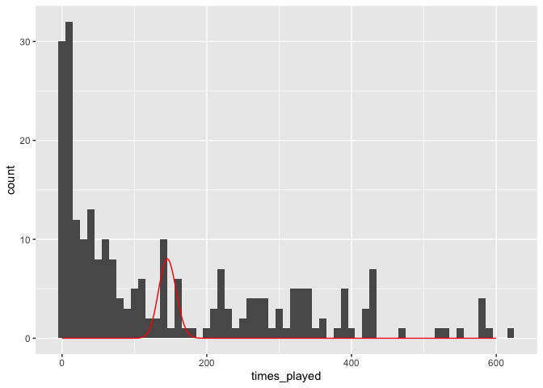
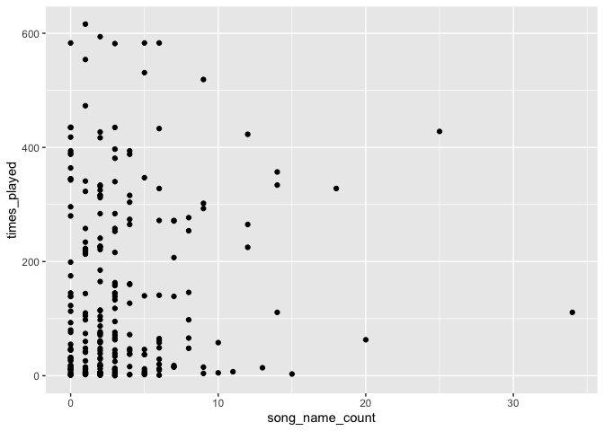

I love the Grateful Dead. As a musician, I think they’re absolutely
brilliant, but mostly I love rabbit holes. The conventional wisdom that
“every show is different” misses the mark, I think—the fun of the Dead
is seeing how songs evolve between shows, over years. How many times did
they play [this one two-chord
sequence]('https://www.youtube.com/watch?v=rZjm6LyGwzI') in Dark Star?
([Many
times.]('https://archive.org/post/1055387/guide-to-the-tighten-up-jam'))
What about when that riff shows up randomly in a different track the
next show? You can kind of triangulate what’s going on in their minds,
get into Jerry’s head a little bit. The online community of deadheads is
also a blast. [Here’s just the tip of the iceberg of how much work
archivists put into
that.]('http://deadessays.blogspot.com/2010/01/deads-early-thematic-jams.html')
I’ve read this post a dozen times, and a dozen more just like it. It’s a
great thing to hyperfixate on, and a real goldmine when you find the one
random recording from a random place with a minute-long gold nugget in
the middle of an otherwise underwhelming 45 minute jam.

There’s also a pandemic happening. I’m working from home and usually
have one show or another on in the background. I try and go on a nice
walk every day and usualy have a show, or bits and pieces that I cycle
through. I’m consuming more music now than I ever have.

The hallmark of every Grateful Dead lyrical composition is when they
scream the title, full volume, slightly off-kilter during the chorus.
The only song I knew of that didn’t do this, off the top of my head, was
[The Eleven]('https://www.youtube.com/watch?v=J5McdXcZKbw') (which feels
like cheating—the song name is the key signature. Does that count?) This
led me to my research question: *In each Grateful Dead song, how many
times do they say the song title?*

Well, dear reader, let’s find out. I scraped all of the 300ish listed
lyrics from [Mark Leone’s lyrics
archive]('https://www.cs.cmu.edu/~mleone/dead-lyrics.html') and
sanitized them.

Let’s scrape all the lyrics:

``` r
# Get the index page
page <- readLines('https://www.cs.cmu.edu/~mleone/dead-lyrics.html')

# Remove lines that aren't links to pages
page <- str_subset(page, pattern = "A HREF=\"gdead/dead-lyrics/")

# Convert to a two-column df, one column for song name and one for the link address
page <- tibble(
  song_name = str_extract(page, regex('(?<=\\">)(.*)(?=</A>)')),
  link = str_extract(page, regex('(?<=HREF=\")(.*)(?=\\">)'))
  ) %>% 
  mutate(link = paste0('https://www.cs.cmu.edu/~mleone/', link))

# Retrieve the lyrics from each page

for (i in 1:nrow(page)) {
  message("Retriving lyrics for ", pull(page[i, "song_name"]), ", ", i , " of ", nrow(page))
  page[i, "lyrics"] <- paste(readLines(pull(page[i, "link"])), collapse = " ")
}

# Basic processing: make everything lowercase, remove punctuation, remove 0-9, remove parentheticals
page <- page %>%
  mutate(
    song_name_clean = tolower(song_name),
    song_name_clean = str_remove_all(song_name_clean, "(.*?)"), # remove parentheticals
    song_name_clean = str_remove_all(song_name_clean, "[^\\w]"), # remove nonalphanumeric
  ) %>%
  mutate(
    lyrics_clean = tolower(lyrics),
    lyrics_clean = str_remove_all(lyrics_clean, "(.*?)"), # remove parentheticals
    lyrics_clean = str_remove_all(lyrics_clean, "[^\\w]") # remove nonalphanumeric
  )

# Count the number of times the song title appears in the lyrics

page <- page %>%
  rowwise() %>%
  mutate(song_name_count = str_count(lyrics_clean, song_name_clean)- 1,
         song_name_count_fuzzy = list(agrep(lyrics_clean, song_name_clean)))

dead_lyrics <- page
rm(page)
```

Here’s a histogram of the number of times they say the song name in each
song.

``` r
dead_lyrics %>%
  ggplot() + 
  geom_histogram(aes(song_name_count), binwidth = 1)
```



Is that a poisson distribution I see?

``` r
ll <- function(lambda) {-sum(dpois(dead_lyrics$song_name_count, lambda, log = TRUE))}
p <- optim(par = 3, f = ll, lower = 0)
```

    ## Warning in optim(par = 3, f = ll, lower = 0): bounds can only be used with method L-BFGS-B (or Brent)

``` r
ggplot() + 
  geom_histogram(data = dead_lyrics, mapping = aes(song_name_count), binwidth = 1) +
  geom_line(aes(x = 0:30, y=nrow(dead_lyrics)*dpois(0:30, lambda = p$par)), col = "red")
```



Woah woah woah. I think this would be a great time to do a totally nuts
regression. Like… one for that [website on spurious
correlations](https://www.tylervigen.com/spurious-correlations)? (a
negative binomial distribution actually fit better, but that’s not the
matter now)

What if we look at the number of times each song was played? I love
deadheads so much—[it’s already been
tabulated](https://whitegum.com/introjs.htm?/RECTAB3.HTM). I used the
“fuzzyjoin” package and it worked super well:

``` r
play_freq <- read_csv("dead_play_freq.csv")

play_freq <- play_freq %>%
  mutate(
    song_name_clean = tolower(`SONG TITLE`),
    song_name_clean = str_remove_all(song_name_clean, "(.*?)"), # remove parentheticals
    song_name_clean = str_remove_all(song_name_clean, "[^\\w]"), # remove nonalphanumeric
  ) %>%
  select(song_name_clean, times_played = `Times\nPlayed`)

agrepl(dead_lyrics$song_name_clean, play_freq$song_name_clean)

dead_lyrics <- stringdist_inner_join(dead_lyrics, play_freq, by = "song_name_clean", max_dist = 10, distance_col  ="distance_col") %>%
  group_by(song_name) %>%
  filter(distance_col == min(distance_col))  %>% 
  filter(n() ==1)
```

Fit a hilariously bad poisson distribution:

``` r
ll <- function(lambda) {-sum(dpois(dead_lyrics$times_played, lambda, log = TRUE))}
p <- optim(par = 3, f = ll, lower = 0)
```

    ## Warning in optim(par = 3, f = ll, lower = 0): bounds can only be used with method L-BFGS-B (or Brent)

``` r
ggplot() + 
  geom_histogram(data = dead_lyrics, mapping = aes(times_played), binwidth = 10) +
  geom_line(aes(x = 0:600, y=nrow(dead_lyrics)*dpois(0:600, lambda = p$par)), col = "red")
```



Take a look at the data:

``` r
ggplot(dead_lyrics) +
  geom_point(aes(song_name_count, times_played)) 
```



And then do a poisson regression on the number of times each song was
played and the number of times they say the song title in the lyrics:

``` r
reg <- glm(times_played ~ song_name_count, data = dead_lyrics, family = poisson(link = "log"))
summary(reg)
```

    ## 
    ## Call:
    ## glm(formula = times_played ~ song_name_count, family = poisson(link = "log"), 
    ##     data = dead_lyrics)
    ## 
    ## Deviance Residuals: 
    ##     Min       1Q   Median       3Q      Max  
    ## -17.974  -13.832   -6.283    8.314   29.603  
    ## 
    ## Coefficients:
    ##                 Estimate Std. Error z value Pr(>|z|)    
    ## (Intercept)     4.921637   0.006819  721.75   <2e-16 ***
    ## song_name_count 0.016880   0.001141   14.79   <2e-16 ***
    ## ---
    ## Signif. codes:  0 '***' 0.001 '**' 0.01 '*' 0.05 '.' 0.1 ' ' 1
    ## 
    ## (Dispersion parameter for poisson family taken to be 1)
    ## 
    ##     Null deviance: 39957  on 242  degrees of freedom
    ## Residual deviance: 39755  on 241  degrees of freedom
    ## AIC: 41183
    ## 
    ## Number of Fisher Scoring iterations: 5

Nuts! Holy signficance, batman! We can conclude that the number of times
Jerry or Bobby says the song name in the song lyrics CAUSES it to be
played more… right? And since we used a fancy poisson regression, it
must be true ;)

I also ran a GAM and a random forest but they weren’t signficant, so we
can discard them.

Note to future employers: this is all sarcastic. Please!

Back to the question at hand. What is the song that says the name the most number of times?
-------------------------------------------------------------------------------------------

``` r
dead_lyrics %>%
  dplyr::select(song_name, song_name_count, times_played) %>% 
  arrange(-song_name_count) %>%
  filter(song_name_count > 10)  %>%
  knitr::kable()
```

| song_name            | song_name_count | times_played |
|:---------------------|----------------:|-------------:|
| Might As Well        |              34 |          111 |
| Good Lovin’          |              25 |          428 |
| To Lay Me Down       |              20 |           63 |
| He’s Gone            |              18 |          328 |
| Money, Money         |              15 |            3 |
| Kansas City          |              14 |          334 |
| Lazy Lightnin’       |              14 |          111 |
| Sugaree              |              14 |          357 |
| Wake Up Little Susie |              13 |           14 |
| Deal                 |              12 |          423 |
| Pretty Peggy O       |              12 |          265 |
| Ship of Fools        |              12 |          225 |
| Heaven Help The Fool |              11 |            7 |

Looks like it is Might as Well, which, yeah. But that is a late-discog
add. Here’s a thought: the song title that has been said the most by the
band, i.e, the number of times the name is said per song \* the number
of plays.

``` r
dead_lyrics <- dead_lyrics %>%
  mutate(total_name_times = song_name_count * times_played) 

dead_lyrics %>%
  dplyr::select(song_name, song_name_count, times_played, total_name_times) %>% 
  arrange(-total_name_times) %>% 
  head(15) %>%
  knitr::kable()
```

| song_name                       | song_name_count | times_played | total_name_times |
|:--------------------------------|----------------:|-------------:|-----------------:|
| Good Lovin’                     |              25 |          428 |            10700 |
| He’s Gone                       |              18 |          328 |             5904 |
| Deal                            |              12 |          423 |             5076 |
| Sugaree                         |              14 |          357 |             4998 |
| Kansas City                     |              14 |          334 |             4676 |
| Truckin’                        |               9 |          519 |             4671 |
| Might As Well                   |              34 |          111 |             3774 |
| The Harder They Come            |               6 |          583 |             3498 |
| Pretty Peggy O                  |              12 |          265 |             3180 |
| Run for the Roses               |               5 |          583 |             2915 |
| Mama Tried                      |               9 |          302 |             2718 |
| Ship of Fools                   |              12 |          225 |             2700 |
| Not Fade Away                   |               5 |          531 |             2655 |
| Goin’ Down The Road Feelin’ Bad |               9 |          293 |             2637 |
| Tennessee Jed                   |               6 |          433 |             2598 |

Amazing. Over a 30-year touring history, the phrase “Good Lovin’” is
said over 10,000 times. I’m so glad we know this now.

I started this because I was genuinely curious what the most-said Dead
song title was, but this became a neat little exercise in model fitting.
Just because something is poisson distributed doesn’t mean fitting a
poisson linear regression is the right move, especially if you can’t
identify a causal mechanism there. I fall into this trap all the time
with spatial data and more ‘serious’ statistical things. But I had fun
here. Thanks Amanda for helping me.
