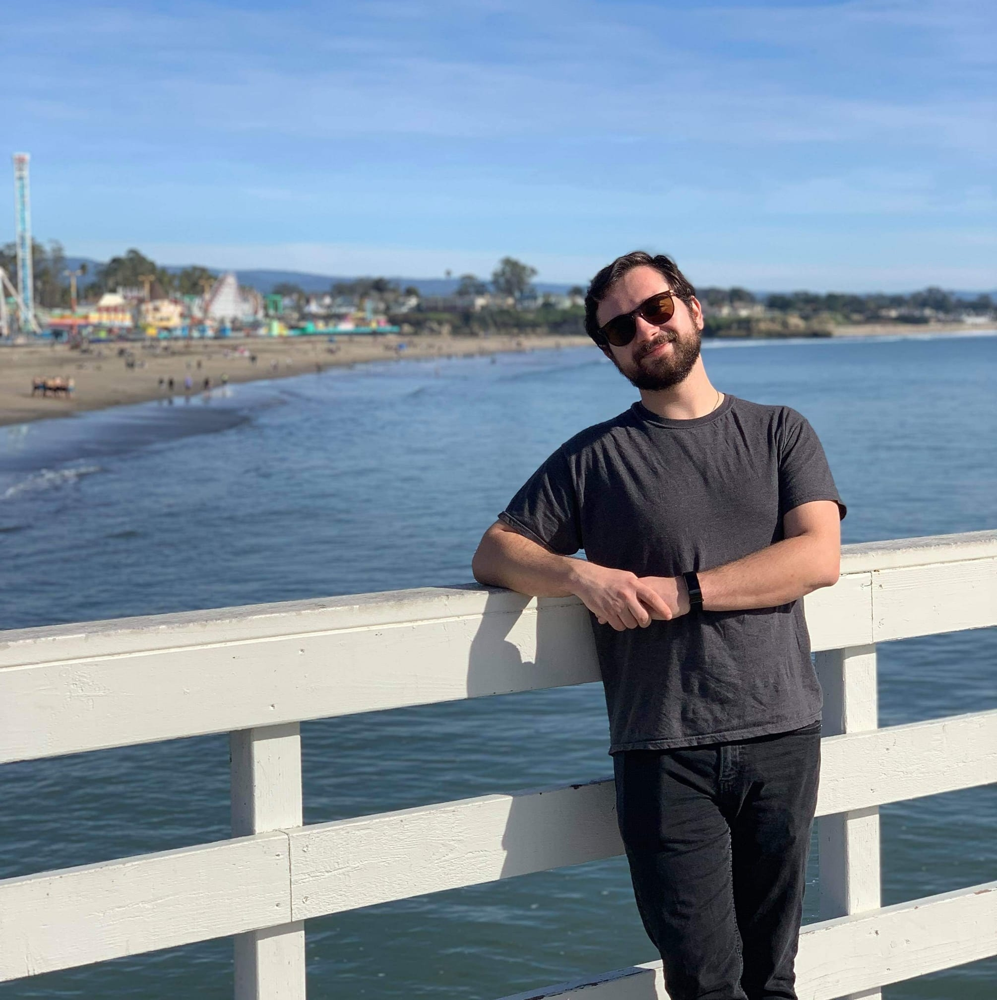

{: style="float: left; height: 200px"}

I am a graduate student at the University of California, Berkeley, in the department of Demography.  
My main fields of interest are spatial demography, spatial statistics, and public health demography, with
a focus on residential and employment inequality.

I am a researcher with the [Berkeley Interdisciplinary Migration Initiative](https://bimi.berkeley.edu/) working on 
the [Mapping Spatial Inequality](https://bimi.berkeley.edu/mapping-spatial-inequality) project. I have previously
been affiliated with the [Human Mortality Database](http://mortality.org) and  the [Chicago Democract Project](http://cdp.northwestern.edu).
