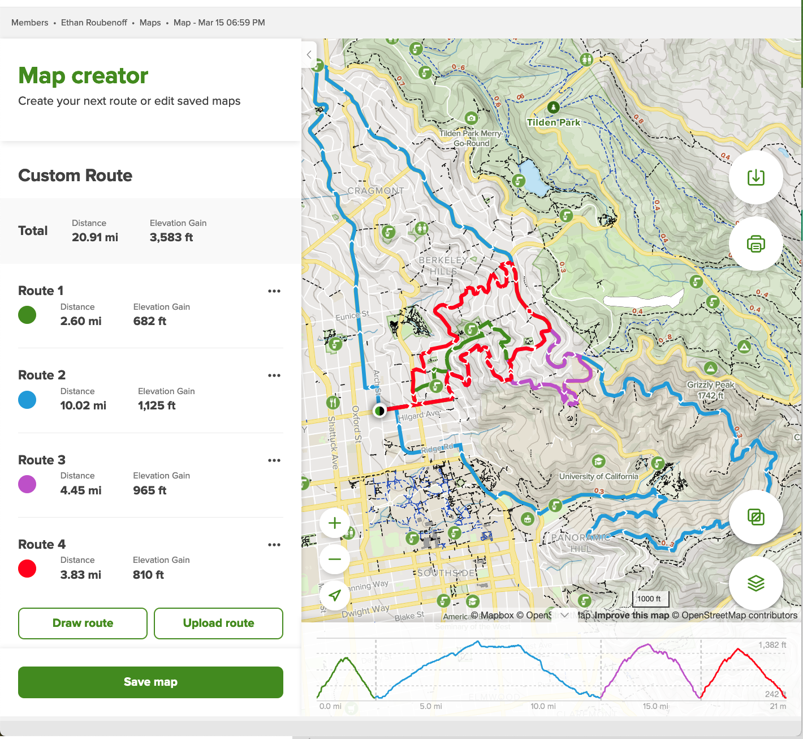

```{r, include=FALSE}
library(tidyverse)
library(sf)
base_dir <- "~/eroubenoff.github.io" # i.e. where the jekyll blog is on the hard drive.
base_url <- "/" # keep as is

# If the document is currently being knit, do this; skip it in normal execution
if (!is.null(knitr::current_input())){
  
  # Output path for figures
  fig_path <- paste0("assets/img/", str_remove(knitr::current_input(), ".Rmd"), "/")
  
  # Set base directories
  knitr::opts_knit$set(base.dir = base_dir, base.url = base_url)
  
  # Set figure directories
  knitr::opts_chunk$set(fig.path = fig_path,
                      cache.path = '../cache/',
                      message=FALSE, warning=FALSE,
                      cache = FALSE)
}

```

We have been in COVID-19 lockdown for a whole year. Holy moly! I feel like
I quantum tunneled from last March until now. This blows my mind---I feel like
it has been forever, and at the same time, no time at all.

More than anything, I have learned that I really, really love walking. I spend
all day parked in front of my computer in my living room.  I sleep 20 feet behind
me. I cook meals 10 feet to my right. I am intertly trapped in these walls.

When I first moved to Berkeley in 2018, I was bored one day and decided to 
walk just around the neighborhood.  "This is so weird!" I remember thinking.
"Who takes walks for fun? Walking is a means of transportation, not an activity!"

I don't think I've so dramatically changed my mind on anything.

Going for a good medium-length walk has been my 'anchoring vignette' of the pandemic.
I try and do it every day.  More than two days without walking and I feel it:
I don't sleep right, I'm eating like garbage, I'm anxious and antsy.  
Quite literally, walking keeps me sane.

It took some experimentation but I settled on a good 4-ish mile loop.  I live
at the base of the Berkeley hills and walk as directly up the hill as possible.
I try to really push myself here: brisk pace, heart rate up. At the top,
I take a lazy, winding path down. The whole thing takes exactly and hour and a half.

It's a little hard to see because of the way Alltrails does feature layering, 
but my main walks are red and purple; green is the "short" version and blue is
"I have the whole afternoon off" version. (I started and stopped not exactly
at my apartment, for privacy, I guess.)



Here's the view from Lawrence Hall of Science (The top of the purple route).
You can see my apartment in here, actually.


If you have an Android phone, Google tracks your location always ("Timeline").
This is a little spooky from a cybersecurity and data ethics perspective,
but I think it's kind of neat to be able to look back on where I've been.
You can download your data from [Google Takeout](https://takeout.google.com/).
I selected "Fit" (walking and tracking data) and "Timeline" (KML shapefiles).

## Let's start with the Fit data:


```{r}
daily_activity_metrics <- read_csv(
  "./Takeout 2/Fit/Daily activity metrics/Daily activity metrics.csv",
  col_types = cols()
  )
head(daily_activity_metrics)
```

There's a lot of information here, and most of it isn't super useful.  Let's pull
some cols after the lockdown began (March 16th, 2020 for me)

```{r}
daily_activity_metrics <- daily_activity_metrics %>%
  filter(lubridate::as_date(Date) >= lubridate::as_date("2020-03-16")) %>%
  select(Date, 
         kcal  = `Calories (kcal)`,
         steps = `Step count`,
         distance = `Distance (m)`,
         move_mins = `Move Minutes count`,
         walking_duration = `Walking duration (ms)`) %>%
  drop_na()
head(daily_activity_metrics)
```

First, let's look at steps:

```{r}
ggplot(daily_activity_metrics) +
  geom_point(aes(Date, steps))
```

I think that high point in July was hiking Cloud's rest in Yosemite.

And then distance: 
```{r}
ggplot(daily_activity_metrics) +
  geom_point(aes(Date, distance))
```

I have no idea what this 60-km walk was.... likely something weird with GPS (sometimes
it thinks that I was walking when I was actually just driving really slowly).

There's naturally a pretty strong correlation between distance and steps:
```{r}
ggplot(daily_activity_metrics) +
  geom_point(aes(steps, distance))
summary(lm(distance~steps, data = daily_activity_metrics))
```


This estimates one of my steps as being approximately 0.58 meters, or 1.9
feet.  I'm about 5'5 (on a good day): according to this [probably not very accurate table](https://www.verywellfit.com/set-pedometer-better-accuracy-3432895),
my stride length should be 27", which is slightly too long. I have 
short legs, I guess!

Out of pure interest, calories:
```{r}
ggplot(daily_activity_metrics) +
  geom_point(aes(Date, kcal))
```


Funny: the last dot is below 1000 calories: that's probably today, when 
it's still morning and I haven't gone outside yet! Funny.


I have reason to think that there is one anomaly (oh! I think I went biking 
that day). I'm going to filter that one out:
```{r}
daily_activity_metrics <- daily_activity_metrics %>%
  filter(distance < 60000)
```


Sum it up and convert to miles:

```{r}
sum(daily_activity_metrics$distance)/1609
```


Holy moly! 1,220 miles I've walked in a year! That's nuts, man. 
That's about 3.3 per day, which is consistent with my normal walk (between 3-4 miles),
but obviously I did a little more some days and took a few off.


